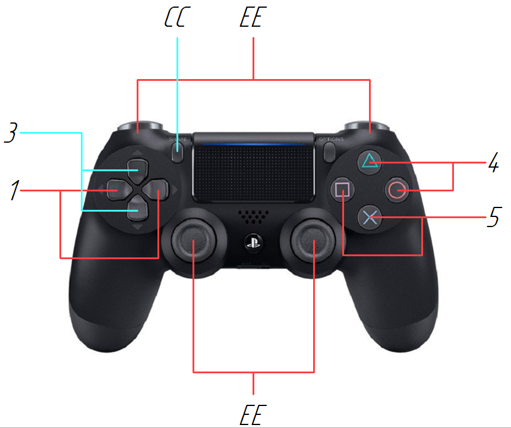
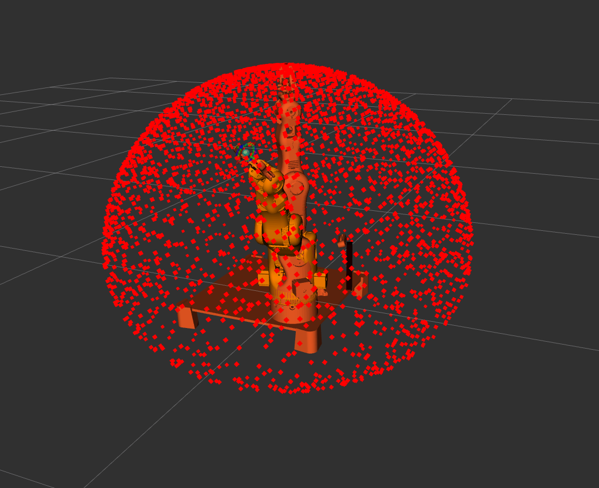

# **BCN3D_MOVEO**


## Оглавление

- [Цель](#цель)
- [Версия операционной системы и необходимые зависимости](#версия-операционной-системы-и-необходимые-зависимости)
- [Установка](#установка)
- [Порядок запуска файлов](#порядок-запуска-файлов)
    - [Запуск в разных терминалах](#запуск-в-разных-терминалах)
    - [Видео примера выполнения движения в визуализаторе RViz](#видео-примера-выполнения-движения-в-визуализаторе-rviz)
- [Управление манипулятором с подключением платы через TCP](#управление-манипулятором-с-подключением-платы-через-tcp)
    - [Запуск в разных терминалах c TCP](#запуск-в-разных-терминалах-c-tcp)
        - [Пример выполнения движения манипулятором](#пример-выполнения-движения-манипулятором)
            - [Вид с компьютера](#вид-с-компьютера)
            - [Реальная среда](#реальная-среда)
    - [Запуск в одном терминале c tmux](#запуск-в-одном-терминале-c-tmux)
- [Захват объекта с применением маркеров ArUco](#захват-объекта-с-применением-маркеров-aruco)
- [Захват объекта с применением нейронной сети](#захват-объекта-с-применением-нейронной-сети)
- [Отрисовка рабочей зоны манипулятора](#отрисовка-рабочей-зоны-манипулятора)
- [Дальнейшие планы](#дальнейшие-планы)

# Цель

Целью данной работы является создание прототипа манипулятора, который будет использоваться в качестве тестового стенда. Это позволит проводить испытания и отладку программного обеспечения, разрабатываемого для других проектов.

#  Версия операционной системы и необходимые зависимости

| Параметр                        | Значение         |
|---------------------------------|------------------|
| Версия операционной системы     | Ubuntu 22.04     |
| Версия ROS2                     | Humble           |

| Зависимости                                        |
|----------------------------------------------------|
| ros-${ROS_DISTRO}-xacro                            |
| ros-${ROS_DISTRO}-moveit                           |
| ros-${ROS_DISTRO}-ros2-control                     |
| ros-${ROS_DISTRO}-rviz-visual-tools                |
| ros-${ROS_DISTRO}-ros2-controllers                 |
| ros-${ROS_DISTRO}-robot-state-publisher            |
| ros-${ROS_DISTRO}-joint-state-publisher            |
| ros-${ROS_DISTRO}-realsense2-camera                |
| ros-${ROS_DISTRO}-diagnostic-updater               |
| ros-${ROS_DISTRO}-joint-state-publisher-gui        |

#  Установка

- [Оглавление](#оглавление)

Сначала необходимо создать рабочее пространство:

```bash
mkdir -p ros2_ws/src

```

После этого скачать репозиторий и собрать пространство:

```bash
cd ros2_ws/src

git clone http://git.robotic.net:3000/PodkolzinDD/ros2_bcn3d_moveo.git

cd ..

colcon build

. install/setup.bash

```

#  Порядок запуска файлов

- [Оглавление](#оглавление)

## Запуск в разных терминалах

Для начала запустите move_group, RViz и другие компоненты (при подключении геймпада можно управлять манипулятором как по степеням подвижности, так концевой точкой):

```bash
ros2 launch bcn3d_moveo_moveit bcn3d_moveo_joy.launch.py

```

## Видео примера выполнения движения в визуализаторе RViz


> В данной итерации я не подключал питание к Mega, поэтому при подключении плат по USB необходимо сначала подключить Mega, а затем Uno. Это связано с тем, что в коде Uno указан порт USB, и изменение порядка подключения может привести к ошибке.

Затем запустите скрипт для приема данных с тактильных датчиков, которыми управляет Arduino Uno. Скрипт инициализирует топик "fsr_joint_states":

```bash
ros2 run py_pubsub go_go_fsr_topic

```
Далее необходимо запустить скрипт, отвечающий за взаимодействие с платой Arduino Mega. Эта плата управляет шаговыми двигателями степеней подвижности и сервоприводом схвата:

```bash
ros2 run py_pubsub go_go_bcn3d

```

После этого можно проверить выполнение перемещения в заранее заданную точку:

```bash
ros2 run bcn3d_moveo_scripts go_go_to_the_point

```

#  Управление манипулятором с подключением платы через TCP

- [Оглавление](#оглавление)

## Запуск в разных терминалах c TCP

Для начала запустите move_group, RViz и другие компоненты (при подключении геймпада можно управлять манипулятором как по степеням подвижности, так концевой точкой):

```bash
ros2 launch bcn3d_moveo_moveit bcn3d_moveo_joy.launch.py

```

### Пример выполнения движения манипулятором

#### Вид с компьютера


#### Реальная среда


Скрипт, в котором можно настроить кнопки "joystick_servo_example.cpp" (отдельные параметры Servo можно изменять в конфигурационном файле "bcn3d_moveo_sim_config.yaml").



1, 3, 4, 5 - степени подвижности манипулятора;
EE - управление концевой точкой;
CC - смена режима управления (телеуправление, через скрипты).

> Обнаружена ошибка: когда происходит переключение с режима скриптового управления на телеуправление, манипулятор автоматически возвращается в последнюю позицию, которая была задана при управлении с помощью геймпада.


Затем запустите скрипт для приема данных с тактильных датчиков, которыми управляет Arduino Uno. Скрипт инициализирует топик "fsr_joint_states":

```bash
ros2 run py_pubsub go_go_fsr_topic

```

Далее необходимо запустить скрипт, отвечающий за взаимодействие с платой Arduino Mega. Эта плата управляет шаговыми двигателями степеней подвижности и сервоприводом схвата:

```bash
ros2 run py_pubsub go_go_bcn3d_tcp

```

## Запуск в одном терминале c tmux

Конечный вариант запуска будет выглядеть примерно следующим образом:

```bash
bash go_go_big_run

```

# Захват объекта с применением маркеров ArUco

- [Оглавление](#оглавление)

> В разработке 

Для начала необходимо запустить все компоненты, описанные выше (файл запуска, скрипт связи с Uno, скрипт связи с Mega). Затем необходимо запустить скрипт для получения кадра объекта относительно камеры:
```bash
ros2 run py_pubsub go_go_find
```


Для отображения маркера необходимо его добавить в RViz и запустить скрипт:
```bash
ros2 run py_pubsub go_go_object
```


Чтобы захватить объект необходимо создать кадр для конечной точки манипулятора:
```bash
ros2 run py_pubsub go_go_point_to_grasp
```

# Захват объекта с применением нейронной сети

- [Оглавление](#оглавление)

> В разработке

Для начала необходимо запустить все компоненты, описанные выше (файл запуска, скрипт связи с Uno, скрипт связи с Mega). Затем необходимо запустить скрипт для создания кадра камеры (данные получены с помощью qr-метки):

```bash
ros2 run py_pubsub go_go_camera
```

После этого необходимо установить соединение с удаленным компьютером по SSH, на котором будет запущена нейронная сеть. На удаленном компьютере запустите скрипт start.py, а на локальном компьютере запустите соответствующий скрипт:

```bash
ros2 run py_pubsub go_go_sub

```

И, наконец, после ожидания, запустите передачу изображений с камеры:

```bash
cd src/py_pubsub/py_pubsub/

python3 pub.py 

```
# Отрисовка рабочей зоны манипулятора

- [Оглавление](#оглавление)

С помощью скрипта можно отобразить рабочую зону:

```bash
ros2 run py_pubsub go_go_workspace_all

```


Чтобы отобразить только внешний слой ограничений рабочей зоны, необходимо использовать команду:

```bash
ros2 run py_pubsub go_go_workspace

```


Для отображения внутреннего слоя ограничений используйте команду:

```bash
ros2 run py_pubsub go_go_workspace_inside

```


Для визуализации в RViz выполните следующие шаги.

Перейдите в Displays -> Add -> PointCloud2.
В настройках PointCloud2 выберите соответствующую тему (Topic) для отображения:
 - /workspace_points для визуализации внешнего слоя;
 - /workspace_inside_publisher для визуализации внутреннего слоя;
 - /workspace_points_all для отображения всех доступных перемещений.


Также предусмотрен вариант отрисовки рабочей зоны поверхностями. Для этого необходимо запустить следующие скрипты:
```bash
ros2 run py_pubsub go_go_workspace_delaunay_inside 

ros2 run py_pubsub go_go_workspace_delaunay

```


Для визуализации в RViz выполните следующие шаги.

Перейдите в Displays -> Add -> Marker.
В настройках Marker выберите соответствующую тему (Topic) для отображения:
 - /surface_outside для визуализации внешнего слоя;

 - /surface для визуализации внутреннего слоя.


# Дальнейшие планы

- [Оглавление](#оглавление)

Планы развития проекта.

1. Разработка алгоритма обратной кинематики (использование нейронных сетей для решения обратной задачи кинематики, что позволит манипулятору эффективно достигать заданных точек в пространстве).

2. Настройка системы захвата объектов (применение нейронных сетей для улучшения точности и надежности процесса захвата и удержания объектов).

3. Устранение технических и программных недоработок*. 
    
_*Устранение люфта в четвертой степени подвижности.
Исправление звука работы двигателей во второй степени подвижности.
Устранение люфтов в механизме схвата.
Исправление программных ошибок, например, проблемы с переключением в режим управления геймпадом._